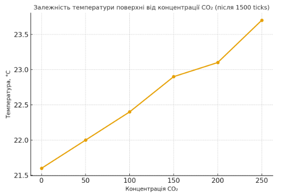

# Комп'ютерні системи імітаційного моделювання

# **СПм-24-1, Савуляк Владислав Олександрович**

## **Лабораторна робота №1. Опис імітаційних моделей та проведення обчислювальних експериментів**

## Варіант №2, модель у середовищі NetLogo:

[Climate Change](http://www.netlogoweb.org/launch#http://www.netlogoweb.org/assets/modelslib/Sample%20Models/Earth%20Science/Climate%20Change.nlogo). Дослідження парникового ефекту, зміни температури земної поверхні при різній концентрації вуглекислого газу, наявності хмарності, снігу тощо.

## **Вербальний опис моделі:**

Модель імітує потік енергії в системі Земля–Атмосфера, демонструючи фізичну суть парникового ефекту та механізм глобального потепління. Кожен агент є пакетом енергії (фотоном): жовті промені - це сонячне видиме світло, що падає на Землю, а темно-червоні - інфрачервоне (теплове) випромінювання, що йде від нагрітої поверхні назад у космос.

## **Керуючі параметри:**

- sun-brightness - яскравість Сонця (0–1, за замовчуванням 1). Керує кількістю сонячних променів, що надходять до Землі за один тік; 1 = 100 % реальної сонячної постійної;
- albedo - альбедо Землі (0–1, за замовчуванням 0.6). Визначає, яка частка сонячного світла відбивається одразу в космос; 0.6 - це високе альбедо (багато хмар/льоду), 0.3 - типове реальне значення;
- add cloud - кнопка, що миттєво збільшує альбедо на ~0.05–0.1 (імітує появу хмар);
- remove cloud - кнопка, що зменшує альбедо назад (прибирає хмари);
- add CO2 - кнопка, що додає 5–10 одиниць CO₂ в атмосферу (значення в моніторі CO2 amount зростає);
- remove CO2 - кнопка, що видаляє частину молекул CO₂;
- CO2 amount - поточна кількість молекул CO₂ в атмосфері (виводиться числом, оновлюється при натисканні add/remove CO2);
- watch a ray - кнопка, що підсвічує один випадковий фотон і дозволяє стежити за його долею (дуже зручно для демонстрації);
- графік Global Temperature - показує зміну температури з плином часу (червона лінія).

## **Внутрішні параметри:**

- sky-top - координата верхньої межі атмосфери;
- earth-top - координата верхньої межі поверхні Землі;
- temperature - поточна глобальна температура, що змінюється внаслідок енергетичного балансу системи.

## **Показники роботи системи:**

- **Мінімальна та максимальна температура за час симуляції** - найнижче і найвище значення глобальної температури поверхні Землі (в умовних одиницях), що характеризують теплові межі системи.
- **Мінімальна та максимальна кількість CO₂** - найменша і найбільша кількість молекул вуглекислого газу в атмосфері, зафіксована за весь час моделювання.
- **Пік теплового буфера** - максимальна кількість червоних *heat* черепашок, що одночасно накопичилися на поверхні Землі; показує момент найвищого нагріву перед початком інфрачервоного випромінення.
- **Середня щільність CO₂ в атмосфері** - середнє значення концентрації парникових газів протягом симуляції; показник інтенсивності парникового ефекту.
- **Кількість «венеріанських епізодів»** - число випадків, коли температура перевищувала 70 умовних одиниць; характеризує моменти запуску некерованого парникового ефекту.

## **Алгоритм зміни станів моделі:**

Алгоритм зміни станів у моделі Climate Change полягає у поступовій зміні температури залежно від взаємодії сонячного випромінення, поверхні Землі, атмосфери та вмісту парникових газів.

Спочатку натискається кнопка setup, і модель ініціалізує початкові параметри: яскравість Сонця, альбедо, кількість CO₂, а також встановлює базову температуру. Після цього, при натисканні кнопки go, запускається основний цикл моделі, у якому на кожному кроці часу відбувається кілька процесів. Сонячне випромінення потрапляє на поверхню Землі, де частина енергії відбивається залежно від альбедо, а решта поглинається, підвищуючи температуру поверхні. Земля у відповідь випромінює тепло у вигляді інфрачервоного випромінення, частина якого поглинається вуглекислим газом в атмосфері, створюючи парниковий ефект.

Якщо користувач додає CO₂ за допомогою кнопки add CO2, частина тепла затримується в атмосфері, і глобальна температура зростає. Якщо навпаки CO₂ видаляється, тепло швидше виходить у космос, і температура знижується. Додавання хмар збільшує альбедо, тому більша частина сонячного світла відбивається, що сприяє охолодженню. Видалення хмар зменшує альбедо і призводить до нагрівання. Також користувач може змінювати яскравість Сонця - збільшення цього параметра підвищує температуру, а зменшення - охолоджує систему.

Після кожного кроку модель оновлює температуру та відображає її зміну на графіку Global Temperature. Процес триває доти, доки користувач не зупинить симуляцію або не буде досягнуто потрібної кількості тактів. Таким чином, модель демонструє, як зміна параметрів, що впливають на енергетичний баланс планети, поступово змінює стан кліматичної системи.

### Недоліки моделі:

- повністю відсутня водяна пара - головний парниковий газ, що дає 55–70 % усього ефекту;
- немає океанів - реального акумулятора, який забирає 90 % надлишкового тепла на століття;

## **Обчислювальні експерименти**

### 1. Вплив концентрації CO₂ за відсутності хмар

Досліджується, як концентрація CO₂ впливає на рівноважну температуру Землі за відсутності хмар. Джерелом парникового ефекту в моделі є молекули CO₂, які затримують інфрачервоне випромінювання. Чим більше молекул CO₂, тим більше тепла «повертається» до поверхні. Проводиться 6 симуляцій, де кількість кліків «add CO2» змінюється від 0 до 10. Для кожного запуску фіксується температура після повної стабілізації (1500 тіків).
Керуючі параметри мають такі значення:

- sun-brightness = 1
- temperature = 12 (початкова температура, яка встановлена системою)
- albedo = 0.6
- CO₂  = 0 (+50 (+2 add CO₂) з кожним новим прогоном)
- Cloud = 0
- тривалість прогону: 1500 тіків

| Кліків add CO₂ | CO₂ | Температура після 1500 тіків |
| --- | --- | --- |
| 0 | 0 | 21.6 |
| 2 | 50 | 22 |
| 4 | 100 | 22.4 |
| 6 | 150 | 22.9 |
| 8 | 200 | 23.1 |
| 10 | 250 | 23.7 |

Графік має монотонно зростаючий характер , тобто із збільшенням кількості CO₂ температура поверхні поступово підвищується. Це свідчить про наявність парникового ефекту - чим більше парникових газів, тим менше теплового випромінювання залишає атмосферу, і тим сильніше прогрівається поверхня планети.

## 2. Вплив хмарності на компенсацію високого рівня CO₂

Досліджується, як хмарність здатна компенсувати високий рівень CO₂. Джерелом охолодження є підвищене відбиття сонячного світла. При концентрації CO₂ = 150 молекул (≈420 ppm). Проводиться 6 симуляцій з різною кількістю кліків «add cloud».
Керуючі параметри мають такі значення:

- sun-brightness = 1
- temperature = 12 (початкова температура, яка встановлена системою)
- Сloud = 0 (+2 add Сloud з кожним новим прогоном)
- CO₂ = 150 молекул (відповідає сучасному рівню парникових газів в атмосфері)
- albedo = 0.6
- тривалість прогону: 1500 тіків

| Кліків add cloud | Температура після 1500 тіків |
| --- | --- |
| 0 | 22.5 |
| 2 | 21.3 |
| 4 | 18.6 |
| 6 | 17.6 |
| 8 | 15.7 |
| 10 | 15.3 |

Зі збільшенням кількості кліків add cloud, тобто збільшенням хмарності, температура поступово зменшується. Це свідчить про те, що хмари підвищують альбедо (відбивну здатність планети), зменшуючи кількість сонячного випромінювання, яке поглинається поверхнею.

## 3. Вплив альбедо на клімат

Метою даного експерименту є дослідження того, як зміна альбедо, тобто відбивної здатності поверхні Землі  впливає на кліматичну систему та температуру планети. Альбедо є важливим фактором енергетичного балансу: чим воно вище, тим більша частина сонячної енергії відбивається назад у космос, і тим нижчою залишається температура поверхні. Зменшення альбедо, наприклад, через танення снігу або льоду, призводить до більшого поглинання тепла й посилює глобальне потепління.

Керуючі параметри мають такі значення:

- sun-brightness = 1 (сталий рівень)
- CO₂ = 150 молекул (відповідає сучасному рівню парникових газів в атмосфері)
- temperature = 12 (початкова температура, яка встановлена системою)
- Сloud = 0 (щоб вплив хмарності не спотворював результати)
- albedo = 0.2-0.7
- тривалість прогону: 1500 тіків

| Albedo | Температура після 1500 тіків |
| --- | --- |
| 0.2 | 31.7 |
| 0.3 | 29.8 |
| 0.4 | 26.4 |
| 0.5 | 24.2 |
| 0.6 | 22.4 |
| 0.7 | 21 |

Графік залежність температури від значення альбедо відображає, що зі збільшенням альбедо температура поступово знижується. При низькому альбедо (0.2) температура становить близько 31.7 °C, а при високому (0.7) - лише 21 °C. Це пояснюється тим, що чим вище альбедо, тим більше сонячного випромінення відбивається від поверхні Землі, і тим менше енергії поглинається, що призводить до охолодження планети. Графік демонструє обернену залежність між альбедо та середньою глобальною температурою: збільшення відбивної здатності поверхні Землі зменшує її нагрівання.
